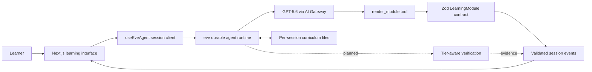

# Dean

**Dean does not enroll you in a course. It compiles a teacher for the
professional capability you need next.**

Dean is an experimental professional-learning platform built for the OpenAI
Build Week 2026 Education Track. A learner names a career outcome, answers a
few calibration questions, and watches Dean create an inspectable curriculum
as files. The resulting tutor teaches through short interactive modules,
adapts when evidence shows that the learner is stuck, and states how strongly
it can verify the learner's work.

The core idea is simple:

- personalize the **teacher**, not just the conversation;
- teach one concept at a time through typed interactive blocks;
- verify work with the strongest honest method available;
- visibly change the curriculum when a learner struggles;
- help learners produce useful professional decisions and artifacts.

> [!IMPORTANT]
> This repository contains the verified **Day 1 foundation** and the approved
> three-track Build Week routing contract. The running agent can select and
> scaffold exactly those three tracks, but the complete renderer, grading loop,
> track content, adaptation UI, and deployment remain planned work. See
> [Current status](#current-status) for the exact boundary.

## Table of contents

- [What Dean is](#what-dean-is)
- [Build Week experience](#build-week-experience)
- [How Dean works](#how-dean-works)
- [Verification tiers](#verification-tiers)
- [Learning experience](#learning-experience)
- [Current status](#current-status)
- [Architecture](#architecture)
- [Learning-module contract](#learning-module-contract)
- [Technology](#technology)
- [Run it locally](#run-it-locally)
- [Smoke test the current baseline](#smoke-test-the-current-baseline)
- [Project structure](#project-structure)
- [Available commands](#available-commands)
- [Safety and design constraints](#safety-and-design-constraints)
- [How GPT-5.6, Codex, and Linear are used](#how-gpt-56-codex-and-linear-are-used)
- [Roadmap](#roadmap)
- [Documentation](#documentation)

## What Dean is

Most AI tutors personalize a conversation while leaving the underlying teacher
unchanged. They may use the same explanation format for every learner, treat
model opinion as grading, or answer failure with a longer version of the same
explanation.

Dean treats a tutor as an inspectable program made from files:

- a learner profile;
- a curriculum map;
- lesson plans;
- verification contracts;
- teaching and recovery strategies;
- eventually, review schedules and progress evidence.

Those files become the source of truth for one learner's tutor. When the
learner struggles, Dean can rewrite the relevant lesson and teach the concept
through a different modality. The adaptation becomes a visible file change,
not an invisible prompt adjustment.

Dean's long-term boundary is **professional capability**, not one programming
language or school subject. SQL remains important because it supports exact,
machine-verifiable exercises. In the Build Week product, SQL serves the broader
Data to Decision outcome instead of defining the whole platform.

## Build Week experience

The Build Week MVP deliberately proves breadth and depth with three curated
tracks. It does not promise arbitrary “learn anything” behavior.

| Track | Build Week depth | Learner outcome | Verification |
| --- | --- | --- | --- |
| **Data to Decision** | Complete hero journey | Turn campaign data into a recommendation a director can act on | Machine and structural checks |
| **Build a Work Tool with Codex** | One polished lesson and artifact | Turn repetitive work into a small tested tool | File, build, or test evidence |
| **Executive Communication** | One interactive preview | Turn a complex update into a concise leadership recommendation | Clearly labeled judgment-supported feedback |

### Data to Decision

The hero journey covers business-question framing, SQL-based retrieval,
visualization interpretation, recommendation writing, deterministic checks,
failure-driven adaptation, and a visible curriculum change.

### Build a Work Tool with Codex

The learner identifies repetitive work, writes acceptance criteria, uses Codex
to build the smallest useful tool, tests it, and explains what changed. The
artifact must pass a bounded file, build, or test check.

### Executive Communication

The learner converts a complex update into a leadership recommendation. Dean
uses a visible rubric, cites observable differences between revisions, and
labels the feedback as guided judgment rather than verified mastery.

## How Dean works

Dean operates in two phases.

### 1. Dean phase: compile the tutor

For a new learner, Dean asks calibration questions one at a time. The questions
identify the learner's desired professional outcome, existing knowledge, work
context, and current ability. Dean then writes a personalized learner profile,
curriculum, and lesson files to the agent's `/workspace` directory.

The files make the teaching plan inspectable. The learner can see the
curriculum appear, understand what Dean plans to teach, and later compare a
lesson before and after adaptation.

### 2. Tutor phase: teach, verify, and adapt

Once the curriculum exists, the agent switches to Tutor mode. Lessons must be
delivered through the typed `render_module` tool.

The planned learning loop is:

1. read the learner profile and current lesson;
2. compose a module from approved learning-block types;
3. validate the module at the tool boundary;
4. render one block at a time;
5. verify the learner's work using the track's declared tier;
6. advance when the evidence meets the stated threshold;
7. rebuild the lesson in a different modality when the learner is stuck.

## Verification tiers

Dean must never claim more certainty than the evidence supports.

1. **Machine-verifiable** work can be executed or compared exactly. Examples
   include queries, code, formulas, files, tests, and structured output.
2. **Structurally verifiable** work can be checked for required components,
   constraints, and relationships, even when several good answers exist.
3. **Judgment-supported** work needs critique, simulation, or a rubric. Dean
   may coach writing, leadership, strategy, and communication, but it must not
   present model judgment as deterministic mastery.

The verification tier belongs to the track contract and must be visible to the
learner.

## Learning experience

Dean uses Brilliant.org as interaction inspiration, not as a visual or brand
clone. The approved interaction grammar is:

- show one learning block at a time;
- display a thin progress indicator;
- lead with interaction when the concept allows it;
- keep on-screen explanation brief;
- provide one prominent action for gradeable work;
- return immediate, unmistakable feedback;
- reveal hints progressively;
- use generous whitespace, one accent color, and minimal shell chrome.

Streaks, XP, leagues, and unrelated gamification are outside the Build Week
thesis.

## Current status

### Verified and present

- GPT-5.6 is configured through Vercel AI Gateway as
  `openai/gpt-5.6-luna`.
- The required `modelContextWindowTokens: 200_000` override is configured.
- The runtime routes exactly the three approved tracks and rejects arbitrary
  subjects with a locked track chooser.
- Track choice persists in durable session state, and generated curriculum
  scaffolds carry the canonical track id and verification tiers.
- The SQL foundation remains a supporting skill for Data to Decision.
- The seven-block Zod learning-module schema is defined.
- `render_module` imports that schema directly as its `inputSchema`.
- Valid module tool events reach the browser through eve's session stream.
- Invalid modules are rejected at the tool boundary.
- Local Docker-backed workspace files survived session parking and a full
  local server restart during the spike.
- The emergency fallback module satisfies the schema with one explain block.
- The professional-learning roadmap and Linear issue contracts are approved
  under `docs/plans/`.

### Planned but not finished

- The frontend still shows `render_module` input in a raw development view.
- The seven production learning components are not built.
- SQL execution and deterministic grading are not wired into the learner UI.
- The complete Data to Decision journey has not passed browser acceptance.
- The Codex artifact lesson and Executive Communication preview are not built.
- Failure-driven rewriting and the visible curriculum diff are not built.
- Guardrails, scheduled review, deployment, and submission validation remain.
- Workspace persistence has not been verified on deployed Vercel Sandbox.

The repository separates verified behavior from planned product work so that
roadmap language never masquerades as shipped functionality.

## Architecture



The model decides what to teach and how to compose a lesson. Deterministic code
owns validation, execution, and machine-verifiable grading. The product labels
structural checks and model-supported judgment separately.

## Learning-module contract

[`lib/module-spec.ts`](lib/module-spec.ts) is the contract between GPT-5.6 and
the screen. The model may compose lessons from seven approved block types:

| Block | Purpose |
| --- | --- |
| `explain` | Short Markdown explanation and universal safe fallback |
| `codeExercise` | Executable exercise with expected output and progressive hints |
| `conceptDiagram` | Data-defined node-and-edge diagram |
| `parameterSlider` | Small playground that changes a value inside a template |
| `dragMatch` | Deterministically checked matching pairs |
| `quiz` | Multiple-choice check with answer explanation |
| `revealSequence` | Learner-paced sequence of small conceptual steps |

Each complete module also declares a concept, title, difficulty, modality,
mastery threshold, and failure strategy. The model emits data, never generated
JSX or HTML. The framework validates that data before the tool executes, and
the frontend will validate it again before rendering.

## Technology

- **Agent framework:** eve `0.24.x`
- **Model:** `openai/gpt-5.6-luna` through Vercel AI Gateway
- **Frontend:** Next.js 16, React 19, TypeScript 6
- **Schema validation:** Zod 4
- **Styling:** Tailwind CSS 4
- **Agent UI:** `useEveAgent()` from `eve/react`
- **Runtime target:** Node.js 24

Exact dependency versions are pinned by `package-lock.json`.

## Run it locally

### Prerequisites

- Node.js 24.x
- npm
- Docker
- a Vercel AI Gateway API key with access to the configured model

### 1. Clone the repository

```bash
git clone https://github.com/tmoody1973/dean-app.git
cd dean-app
```

### 2. Install dependencies

```bash
npm install
```

### 3. Configure the model credential

Create `.env` in the project root:

```dotenv
AI_GATEWAY_API_KEY=replace_with_your_key
```

Replace the placeholder with the real value. `.gitignore` covers `.env*`, so
the local credential must remain untracked.

### 4. Start the development server

```bash
npm run dev
```

The initial sandbox open may take about 30 seconds.

### 5. Open the app

On macOS:

```bash
open http://localhost:3000
```

On other platforms, visit [http://localhost:3000](http://localhost:3000).

## Smoke test the current baseline

To confirm the curated routing contract:

1. Open a fresh page at `http://localhost:3000`.
2. Enter `Data to Decision` and confirm Dean begins that track's three-question
   calibration rather than teaching immediately.
3. In another fresh session, enter an unsupported goal such as `Teach me
   conversational French`.
4. Confirm Dean offers only Data to Decision, Build a Work Tool with Codex, and
   Executive Communication, with no freeform subject option.

Stop the server with `Ctrl+C`.

## Project structure

```text
.
├── agent/
│   ├── agent.ts                         # Model and context configuration
│   ├── channels/eve.ts                  # Runtime channel authentication
│   ├── instructions.md                  # Current Dean/Tutor phase rules
│   ├── lib/learner-session.ts            # Durable selected-track state
│   ├── skills/
│   │   ├── adapt-on-failure.md          # Recovery playbook
│   │   └── dean-generate-curriculum.md  # Calibration and curriculum playbook
│   └── tools/
│       ├── render_module.ts              # Typed lesson-delivery boundary
│       └── select_track.ts               # Approved-track selection boundary
├── app/
│   ├── _components/                     # Learning UI and message rendering
│   └── page.tsx                         # Main application page
├── docs/
│   ├── plans/                           # Approved designs and issue contracts
│   ├── build-playbook.md                # Original Build Week implementation plan
│   ├── dean-product-brief-and-prd.md     # Product brief and requirements
│   └── spike-findings.md                # Verified platform evidence
├── lib/
│   ├── module-spec.ts                   # Schema, parser, fallback, and example
│   └── track-spec.ts                    # Canonical tracks and verification tiers
├── tests/track-spec.test.ts             # Track-contract regression tests
├── AGENTS.md                            # Repository and Linear workflow rules
├── README.md                            # Project overview and setup
└── package.json                         # Scripts and dependencies
```

## Available commands

| Command | Purpose |
| --- | --- |
| `npm run dev` | Start the local web application and eve integration |
| `npm test` | Run track-contract regression tests |
| `npm run typecheck` | Run TypeScript validation without emitting files |
| `npm run build` | Build the Next.js application |
| `npm run start` | Start a previously built Next.js application |
| `npm run dev:eve` | Start eve's development terminal UI |
| `npm run build:eve` | Build the eve agent output |
| `npm run start:eve` | Start a previously built eve agent |

## Safety and design constraints

- **Three curated tracks for Build Week.** The MVP supports Data to Decision,
  Build a Work Tool with Codex, and Executive Communication. Arbitrary subjects
  remain outside the active milestone.
- **Current runtime truth.** Routing and curriculum scaffolds exist for the
  three approved tracks; their complete learning content remains unbuilt.
- **Typed rendering only.** The model emits registry data, never raw generated
  JSX or HTML.
- **No `dangerouslySetInnerHTML`.** Markdown must not create an HTML injection
  path.
- **Tier-aware verification.** Deterministic code owns machine-verifiable
  results; structural and judgment-supported work must be labeled honestly.
- **Tool-boundary validation.** Invalid learning modules are rejected before
  `render_module` executes.
- **Safe frontend fallback.** Invalid UI input must render a safe explanation
  instead of a broken screen.
- **Auditable curriculum.** Runtime curriculum files belong in `/workspace`
  and change through file tools.
- **Credential hygiene.** `.env` files are ignored and must never be committed.

Public-route access controls, session limits, grading timeouts, and output-size
caps must pass before deployment.

## Verified spike findings

The Day 1 spike established four load-bearing facts:

1. **GPT-5.6 works through AI Gateway.** Streaming was observed with
   `openai/gpt-5.6-luna`; eve requires the explicit 200,000-token context
   override.
2. **Workspace files persist locally.** A sentinel file survived parking,
   resuming, and a complete local eve restart with the Docker backend.
3. **The module contract works.** Valid modules produce tool events; invalid
   modules are rejected before execution.
4. **The frontend event path works.** `useEveAgent()` receives
   `render_module` calls as session-stream events even if post-tool narration
   later fails.

Known development sharp edges include empty post-tool narration, invisible
invalid-input events, a slow first Docker sandbox open, the Node 24 requirement,
and Next.js workspace-root confusion when multiple lockfiles exist.

Read [the complete spike report](docs/spike-findings.md) before changing the
architecture.

## How GPT-5.6, Codex, and Linear are used

### GPT-5.6

GPT-5.6 supplies the teaching intelligence. It interprets calibration answers,
writes personalized curriculum files, composes modules that satisfy the typed
schema, and rebuilds lessons after failure. It does not get to override
machine-verifiable results.

### Codex

Codex is both the repository implementation partner and a subject inside the
Build a Work Tool track. Repository work follows approved plans, small issue
contracts, explicit verification, and reviewable commits. Learner-facing Codex
work remains bounded to controlled artifacts during Build Week.

### Linear

Linear tracks consequential work after the approved project is created. The
workflow uses a hybrid source of truth:

- the PRD owns product requirements;
- `docs/plans/` owns approved designs;
- Linear owns status, dependencies, acceptance criteria, and evidence;
- GitHub owns implementation history and commits linked to Linear identifiers.

Every build issue must include Intent, Acceptance criteria, Verification
checklist, Out of scope, and a link to its approved plan. An issue reaches Done
only after its checklist passes against real evidence.

## Roadmap

The approved rolling-wave roadmap begins with 14 detailed Build Week issue
contracts:

1. establish the Linear workflow;
2. generalize track and verification contracts;
3. build the safe module shell;
4. implement seven interactive components;
5. implement deterministic exercise grading;
6. connect components to grading events;
7. complete the Data to Decision hero;
8. build the Codex work-tool secondary track;
9. build the Executive Communication preview;
10. implement evidence-driven hero adaptation;
11. polish the three-track demonstration;
12. add guardrails and scheduled review;
13. deploy and verify durability;
14. validate the submission package.

Later outcomes cover the domain-neutral compiler, durable learner state,
verification infrastructure, career paths, authoring tools, integrations,
expert templates, tutor discovery, and organization-level learning. Each later
outcome must pass brainstorming and design approval before it becomes
implementation work.

Read the [approved product roadmap and Linear project design](docs/plans/2026-07-16-dean-product-roadmap-design.md)
for the full issue contracts, dependencies, and evidence requirements.

## Documentation

- [Product brief and PRD](docs/dean-product-brief-and-prd.md) — original product
  rationale, requirements, and architecture decisions.
- [Approved roadmap design](docs/plans/2026-07-16-dean-product-roadmap-design.md)
  — current professional-learning direction, Build Week scope, issue contracts,
  and later roadmap.
- [Spike findings](docs/spike-findings.md) — verified Day 1 behavior,
  limitations, and operational sharp edges.
- [Build playbook](docs/build-playbook.md) — original ordered Build Week prompts
  and acceptance criteria.
- [Agent instructions](agent/instructions.md) — current runtime Dean/Tutor rules.
- [Curriculum-generation skill](agent/skills/dean-generate-curriculum.md) —
  current calibration and file-generation sequence.
- [Adaptation skill](agent/skills/adapt-on-failure.md) — failure-recovery rules.

## Project scope

Dean is a Build Week prototype for one learner and a desktop web experience.
The active milestone delivers three curated professional-learning tracks at
different depths. Accounts, billing, arbitrary subjects, community features,
freeform generated UI, and the later professional-learning marketplace remain
outside the Build Week implementation scope.
