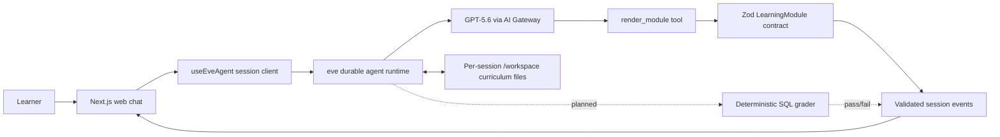

# Dean

**Dean does not enroll you in a course. It compiles a teacher for you.**

Dean is an experimental, personalized SQL tutor built for the OpenAI Build Week 2026 Education Track. A learner describes what they want to accomplish, answers three short calibration questions, and Dean uses those answers to build a four-lesson curriculum as files. The resulting tutor teaches through structured learning modules instead of long, generic chat responses.

The core idea is simple:

- personalize the **teacher**, not just the conversation;
- teach through typed, interactive learning blocks;
- grade executable work with deterministic code rather than AI opinion;
- visibly change the curriculum when a learner struggles.

> [!IMPORTANT]
> This repository currently contains the verified **Day 1 foundation and spike configuration**. The model, agent instructions, curriculum skills, schema contract, tool boundary, and frontend event path are in place. The complete module renderer, deterministic grading loop, adaptation UI, and deployment work are planned but not yet finished. See [Current status](#current-status) for the exact boundary.

## Table of contents

- [Why Dean exists](#why-dean-exists)
- [How it works](#how-it-works)
- [Current status](#current-status)
- [Architecture](#architecture)
- [The learning-module contract](#the-learning-module-contract)
- [Technology](#technology)
- [Run it locally](#run-it-locally)
- [Smoke test](#smoke-test)
- [Project structure](#project-structure)
- [Available commands](#available-commands)
- [Safety and design constraints](#safety-and-design-constraints)
- [Verified spike findings](#verified-spike-findings)
- [How GPT-5.6 and Codex are used](#how-gpt-56-and-codex-are-used)
- [Roadmap](#roadmap)
- [Documentation](#documentation)

## Why Dean exists

Most AI tutors personalize a conversation while leaving the underlying teacher unchanged. They often provide the same explanation format to every learner, grade answers subjectively, and respond to failure by repeating the same idea with more words.

Dean takes a different approach. It treats a tutor as a set of inspectable files:

- a learner profile;
- a curriculum map;
- individual lesson plans;
- teaching and recovery strategies;
- eventually, review schedules and progress state.

Those files become the source of truth for one learner's tutor. When the learner struggles, Dean can rewrite the relevant plan and teach the concept using a different modality. The adaptation is an auditable file change, not an invisible prompt adjustment.

The first supported subject is deliberately narrow: **SQL**. SQL is a strong fit because exercises can run against real data and their results can be checked exactly.

## How it works

Dean operates in two phases.

### 1. Dean phase: compile the tutor

For a new learner, Dean asks exactly three calibration questions, one at a time:

1. **Goal:** What do you want to be able to do with SQL?
2. **Anchor:** What do you already use that involves data—spreadsheets, dashboards, a CRM, or code?
3. **Reality check:** What does a small `SELECT` statement appear to do?

The answers determine the examples, analogies, and starting difficulty. Dean then writes the personalized curriculum to the agent's `/workspace` directory in this order:

1. `learner-profile.md`
2. `curriculum.md`
3. `lessons/01-select.md`
4. `lessons/02-where.md`
5. `lessons/03-inner-join.md`
6. `lessons/04-group-by.md`

### 2. Tutor phase: teach and adapt

Once `/workspace/curriculum.md` exists, the agent switches to Tutor mode. Lessons must be delivered through the typed `render_module` tool.

The planned learning loop is:

1. read the learner profile and current lesson;
2. compose a module from the approved learning-block types;
3. validate it at the tool boundary;
4. render one block at a time in the browser;
5. run and deterministically grade learner exercises;
6. continue when mastery is met;
7. regenerate the lesson in a different modality when mastery is not met.

## Current status

### Verified and present

- GPT-5.6 is configured through Vercel AI Gateway as `openai/gpt-5.6-luna`.
- The required `modelContextWindowTokens: 200_000` override is configured.
- Dean's SQL-only instructions and both curriculum skills are installed.
- The seven-block Zod learning-module schema is defined.
- `render_module` uses that schema directly as its `inputSchema`.
- Valid module tool events reach the browser through eve's session stream.
- Invalid modules are rejected at the tool boundary.
- Local Docker-backed workspace files survived session parking and a full local server restart during the spike.
- The emergency fallback module satisfies the schema with one explain block.

### Not finished yet

- The frontend still shows `render_module` input in a raw development view; the complete component registry is not built.
- SQL execution and deterministic grading are not wired into the learner UI.
- The full calibration-to-curriculum flow has not completed its end-to-end browser acceptance test.
- Failure-driven lesson rewriting and the visible curriculum diff are not built.
- The birth animation, guardrails, scheduling, and deployment are not complete.
- Workspace persistence has not yet been verified on the deployed Vercel Sandbox backend.

This distinction is intentional: the repository documents verified behavior separately from planned product work.

## Architecture



The model decides what to teach and how to compose a lesson. Deterministic code owns validation, execution, and grading boundaries.

## The learning-module contract

[`lib/module-spec.ts`](lib/module-spec.ts) is the contract between GPT-5.6 and the screen. The model may compose lessons from seven approved block types:

| Block | Purpose |
| --- | --- |
| `explain` | A short Markdown explanation and the universal safe fallback |
| `codeExercise` | An executable exercise with expected output and up to three hints |
| `conceptDiagram` | A data-defined node-and-edge diagram |
| `parameterSlider` | A small playground that changes a value inside a code template |
| `dragMatch` | Deterministically graded matching pairs |
| `quiz` | A multiple-choice check with an answer explanation |
| `revealSequence` | A learner-paced sequence of small conceptual steps |

Each complete module also declares:

- one concept and title;
- difficulty: `intro`, `core`, or `stretch`;
- modality: `hands-on`, `visual`, `interactive`, or `narrative`;
- a mastery threshold;
- an `onFailure` strategy that switches modality and may carry the learner's mistake forward.

The model emits data, not JSX or HTML. The framework validates that data before the tool executes, and the frontend will validate it again before rendering.

## Technology

- **Agent framework:** eve `0.24.x`
- **Model:** `openai/gpt-5.6-luna` through Vercel AI Gateway
- **Frontend:** Next.js 16, React 19, TypeScript 6
- **Schema validation:** Zod 4
- **Styling:** Tailwind CSS 4
- **Agent UI:** `useEveAgent()` from `eve/react`
- **Runtime target:** Node.js 24

The exact dependency versions are pinned by `package-lock.json`.

## Run it locally

### Prerequisites

- Node.js 24.x
- npm
- a Vercel AI Gateway API key with access to the configured model
- Docker available locally for eve's sandbox-backed workspace behavior

### 1. Clone the repository

```bash
git clone https://github.com/tmoody1973/dean-app.git
cd dean-app
```

### 2. Install dependencies

```bash
npm install
```

### 3. Configure the model credential

Create a `.env` file in the project root:

```bash
printf 'AI_GATEWAY_API_KEY=replace_with_your_key\n' > .env
```

Replace `replace_with_your_key` with the real value. The repository's `.gitignore` covers `.env*`, so the local credential should not be committed.

### 4. Start the development server

```bash
npm run dev
```

The Next.js integration starts the web application and the local eve runtime together. The initial sandbox open may take about 30 seconds.

### 5. Open the app

On macOS:

```bash
open http://localhost:3000
```

On other platforms, visit [http://localhost:3000](http://localhost:3000) in a browser.

## Smoke test

1. Load a fresh page at `http://localhost:3000`.
2. Enter `Hi` and submit it.
3. The agent should begin with calibration question 1:

   > What do you want to be able to DO with SQL?

4. It should not behave like a general-purpose assistant or begin teaching immediately.

That response confirms that the main instructions and `dean-generate-curriculum` skill are loading. A newly loaded page has no persisted client cursor in the current scaffold, so the first submitted message starts a fresh durable session.

Stop the development server with `Ctrl+C` when finished.

## Project structure

```text
.
├── agent/
│   ├── agent.ts                         # Model and context-window configuration
│   ├── channels/eve.ts                  # Local and deployment channel authentication
│   ├── instructions.md                  # Dean/Tutor phase rules
│   ├── skills/
│   │   ├── adapt-on-failure.md          # Recovery and modality-switching playbook
│   │   └── dean-generate-curriculum.md  # Calibration and curriculum-generation playbook
│   └── tools/render_module.ts           # Typed lesson-delivery boundary
├── app/
│   ├── _components/                     # Web chat and message rendering
│   └── page.tsx                         # Main application page
├── docs/
│   ├── build-playbook.md                # Ordered Days 2–5 implementation plan
│   ├── dean-product-brief-and-prd.md     # Product rationale and requirements
│   └── spike-findings.md                # Verified Day 1 evidence and sharp edges
├── lib/
│   └── module-spec.ts                   # Zod schema, parser, fallback, and example module
├── AGENTS.md                            # Repository rules for coding agents
└── package.json                         # Scripts and dependency declarations
```

## Available commands

| Command | Purpose |
| --- | --- |
| `npm run dev` | Start Next.js and the local eve runtime together |
| `npm run typecheck` | Run TypeScript validation without emitting files |
| `npm run build` | Build the Next.js application |
| `npm run start` | Start a previously built Next.js application |
| `npm run dev:eve` | Start eve's development terminal UI directly |
| `npm run build:eve` | Build the eve agent output |
| `npm run start:eve` | Start a previously built eve agent |

## Safety and design constraints

Dean's architecture establishes several hard boundaries:

- **SQL only for v1.** The current agent must decline other teaching subjects.
- **Typed rendering only.** Model output is rendered as registry data, never raw generated JSX or HTML.
- **No `dangerouslySetInnerHTML`.** Markdown rendering must not become an HTML injection path.
- **No AI grading.** The model may coach the learner, but only deterministic output comparison may determine pass or fail.
- **Tool-boundary validation.** Invalid learning modules are rejected before `render_module` executes.
- **Frontend fallback.** Invalid input must eventually render a safe explanation instead of a broken screen.
- **Auditable curriculum.** Runtime curriculum files belong in `/workspace` and are changed through file tools.
- **Credential hygiene.** `.env` files are ignored and must never be committed.

Production guardrails such as public-route authentication, per-session rate limiting, grading timeouts, and output-size caps remain roadmap work and must be completed before deployment.

## Verified spike findings

The Day 1 spike established four load-bearing facts:

1. **GPT-5.6 works through AI Gateway.** Streaming was observed with `openai/gpt-5.6-luna`; eve requires the explicit 200,000-token context-window override.
2. **Workspace files persist locally.** A sentinel file survived parking, resuming, and a complete local eve restart with the Docker backend. Deployed Vercel Sandbox persistence is still unverified.
3. **The module contract works.** Valid modules produce tool events; invalid modules are rejected before execution.
4. **The frontend event path works.** `useEveAgent()` receives `render_module` tool calls as session-stream events, even if post-tool narration later fails.

Known development sharp edges include:

- post-tool narration can occasionally be empty even after a successful tool event;
- invalid tool input does not create a frontend-visible tool event;
- the first Docker sandbox open can take roughly 30 seconds;
- eve officially expects Node 24.x;
- multiple lockfiles can cause Next.js to infer the wrong workspace root.

Read [the complete spike report](docs/spike-findings.md) before changing the architecture.

## How GPT-5.6 and Codex are used

### GPT-5.6

GPT-5.6 supplies the teaching intelligence at both phases:

- during Dean phase, it interprets calibration answers and writes the personalized curriculum files;
- during Tutor phase, it reads those files and composes learning modules that satisfy the typed schema;
- after failure, it uses the recorded mistake and recovery strategy to rebuild the concept in a different modality.

GPT-5.6 does **not** own validation or grading. Zod enforces the lesson shape, and deterministic code will compare real execution results with expected output.

### Codex

Codex is the implementation partner for the repository. The workflow is intentionally reviewable:

- product decisions and constraints are written in `docs/`;
- build phases are executed in small, ordered increments;
- spike findings are recorded as evidence rather than assumptions;
- schema and prompt files are treated as explicit contracts;
- typechecks and human acceptance gates separate each build phase;
- Git snapshots keep integration changes reviewable.

The Day 1 baseline integrated the verified spike configuration, planning documents, agent prompts, schema correction, and repository rules before feature development began.

## Roadmap

The current build playbook proceeds in human-approved phases:

1. **Day 2 — Renderer and registry:** replace the raw module payload with seven typed React learning components and a safe fallback.
2. **Day 3 — Full learning loop:** add deterministic SQL grading, curriculum generation, failure adaptation, and file-change capture.
3. **Day 4 — Demo experience and guardrails:** polish the birth animation and adaptation diff, then add access controls and limits.
4. **Day 5 — Deployment and submission:** deploy, repeat the persistence test on Vercel, validate clean setup instructions, and prepare the demonstration.

Future expansion is organized by verifiability:

- **Tier 1:** machine-verifiable skills such as Python, Bash, regex, Git, spreadsheet formulas, and data analysis;
- **Tier 2:** structurally verifiable subjects such as math, statistics, logic, and grammar drills;
- **Tier 3:** judgment-graded subjects only with clear labeling that the deterministic grading guarantee no longer applies.

No later phase should begin until the previous phase's acceptance checklist has been confirmed by a human.

## Documentation

- [Product brief and PRD](docs/dean-product-brief-and-prd.md) — the product thesis, audience, scope, requirements, and architecture decisions.
- [Spike findings](docs/spike-findings.md) — verified Day 1 behavior, limitations, and operational sharp edges.
- [Build playbook](docs/build-playbook.md) — the ordered implementation prompts and acceptance criteria for Days 2–5.
- [Agent instructions](agent/instructions.md) — the runtime Dean/Tutor rules.
- [Curriculum-generation skill](agent/skills/dean-generate-curriculum.md) — the three-question calibration and file-generation sequence.
- [Adaptation skill](agent/skills/adapt-on-failure.md) — the planned failure-recovery workflow.

## Project scope

Dean is currently a hackathon prototype focused on one learner, one SQL curriculum, and a desktop web experience. Authentication, accounts, billing, multiple subjects, community features, and freeform generated UI are intentionally outside the current scope.
